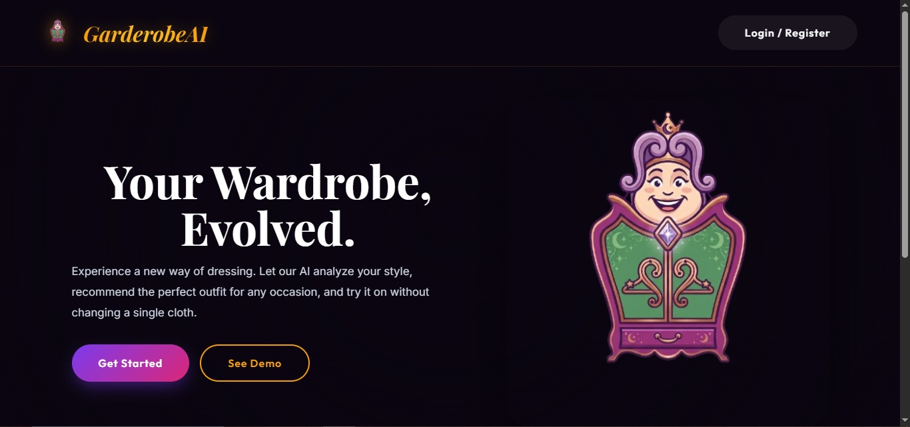
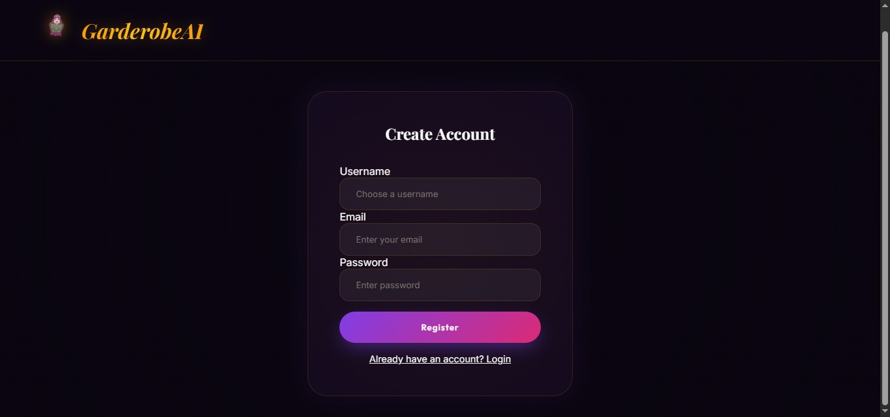
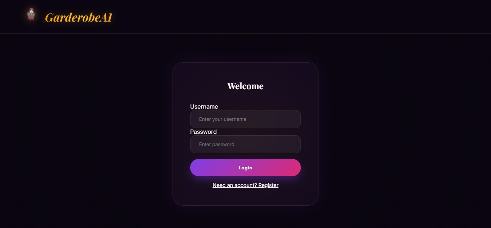
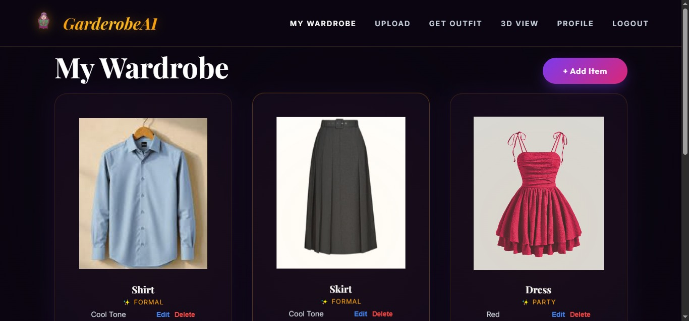
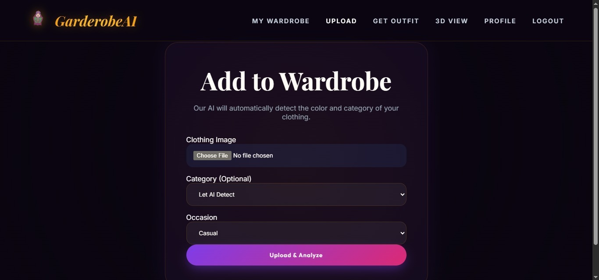
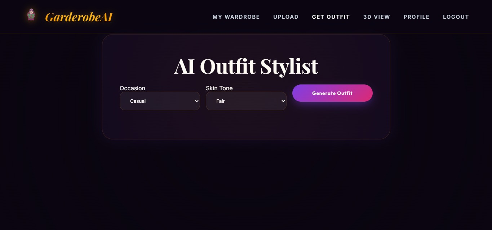
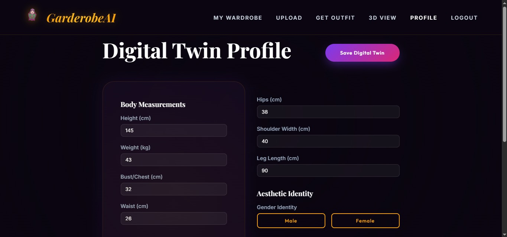
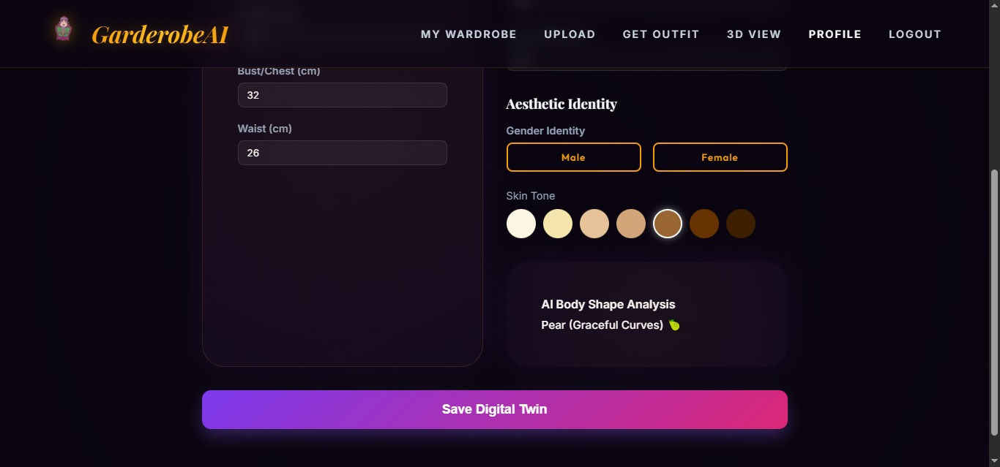
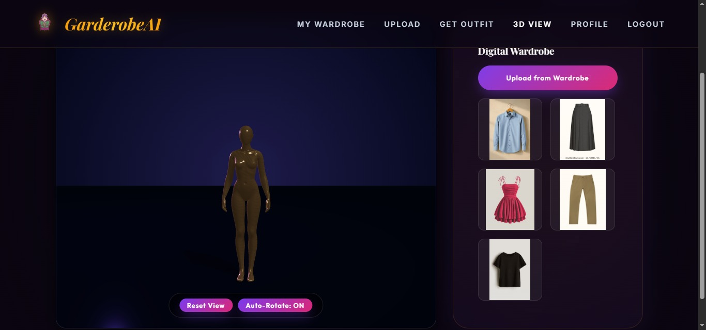

<div align="center">


# 👗 GarderobeAI

### *Your Wardrobe, Evolved.*

An intelligent, web-based wardrobe management and outfit recommendation system powered by **Artificial Intelligence** and **Computer Vision**.

[](https://python.org)
[](https://djangoproject.com)
[](https://opencv.org)
[](LICENSE)


</div>

---

## 📖 Project Description

GarderobeAI is an intelligent, web-based wardrobe management and outfit recommendation system. It lets users upload photos of their clothes, automatically detects the colour and category using AI, and recommends outfits based on their skin tone, body measurements, and occasion. It also includes a **Virtual Try-On** feature and an interactive **3D Mannequin Viewer**.

> 💡 Studies show people spend an average of **17 minutes per day** deciding what to wear. GarderobeAI solves this with AI-driven personalisation.

---

## ✨ Features and Functionalities

| # | Feature | Description |
|:---:|:---|:---|
| 1 | 🔐 **User Authentication** | Register and log in securely using JWT tokens. Only logged-in users can access the wardrobe. |
| 2 | 👤 **Digital Twin Profile** | Save your height, weight, chest, waist, hips, shoulder width, leg length, skin tone, and gender. |
| 3 | 📤 **Clothing Upload** | Upload clothing photos (JPG, PNG, WEBP). The AI automatically detects the colour and category. |
| 4 | 🤖 **AI Clothing Analysis** | Uses OpenCV GrabCut to remove background, then KMeans clustering to find the dominant colour. Aspect ratio is used to classify the garment type (Shirt, Pants, Shoes, etc.). |
| 5 | 🎨 **Outfit Recommendation** | Recommends outfits based on colour harmony theory (complementary, analogous, monochromatic), skin tone, and occasion (Casual, Formal, Party). |
| 6 | 🪞 **Virtual Try-On** | Upload your photo and see how a clothing item looks on you using Hugging Face AI models (IDM-VTON for tops, OOTDiffusion for bottoms). Falls back to OpenCV overlay if the API is unavailable. |
| 7 | 🧍 **3D Mannequin Viewer** | View your clothes on an interactive 3D male or female mannequin using Three.js. You can rotate and zoom the model. |
| 8 | 📊 **Wardrobe Dashboard** | See all your uploaded clothes in a grid. Edit the category or occasion, or delete any item. |

---

## 🛠️ Technology Stack and Tools

### 🔙 Backend

| Technology | Version | Purpose |
|:---|:---:|:---|
| **Python** | 3.10+ | Core backend programming language |
| **Django** | 6.0 | Web framework — handles routing, database ORM, and server logic |
| **Django REST Framework** | Latest | Builds the RESTful JSON API |
| **djangorestframework-simplejwt** | Latest | JWT-based login — access token valid 1 day, refresh token valid 7 days |
| **django-cors-headers** | Latest | Allows the frontend (HTML files) to communicate with the backend API |
| **SQLite** | Built-in | Simple file-based database stored in `db.sqlite3` |

### 🤖 AI / Machine Learning

| Library | Version | Purpose |
|:---|:---:|:---|
| **OpenCV (cv2)** | 4.x | Image processing — background removal using GrabCut, colour space conversion, seamless blending |
| **NumPy** | Latest | Pixel array operations and mathematical calculations |
| **scikit-learn** | Latest | KMeans clustering to find the dominant colour of a clothing image |
| **Gradio Client** | Latest | Calls Hugging Face AI models for virtual try-on over the internet |

### 🤗 AI Models (Hugging Face)

| Model | Hosted At | Used For |
|:---|:---|:---|
| **IDM-VTON** | `yisol/IDM-VTON` | Virtual try-on for tops, shirts, jackets, blazers |
| **OOTDiffusion** | `levihsu/OOTDiffusion` | Virtual try-on for pants, skirts, dresses |
| **Kolors Virtual Try-On** | `Kwai-Kolors/Kolors-Virtual-Try-On` | Backup fallback model if the above two fail |

### 🖥️ Frontend

| Technology | Purpose |
|:---|:---|
| **HTML5** | Structure of all web pages |
| **CSS3** | Styling — dark purple theme, glassmorphism cards, animations |
| **JavaScript (ES6+)** | Page logic, form handling, API calls |
| **Fetch API** | Sends requests to the Django backend and handles responses |
| **localStorage** | Stores the JWT token in the browser so the user stays logged in |
| **Three.js (r128)** | Renders the interactive 3D mannequin in the browser using WebGL |

### 🧰 Tools

| Tool | Purpose |
|:---|:---|
| **Git / GitHub** | Version control and code hosting |
| **VS Code** | Code editor |
| **Postman** | Testing API endpoints during development |
| **SQLite Browser** | Viewing the database during development |

---

## 📁 Project Structure

```
GarderobeAIfinal-main/
│
├── backend/                        ← Django server (the brain of the app)
│   ├── api/
│   │   ├── models.py               ← Database tables: ClothingItem, Recommendation, Profile
│   │   ├── views.py                ← What happens when each API URL is called
│   │   ├── serializers.py          ← Converts Python objects ↔ JSON
│   │   ├── urls.py                 ← Maps URLs to views
│   │   ├── ai_module.py            ← Colour detection + outfit compatibility logic
│   │   ├── tryon_module.py         ← Virtual try-on (Hugging Face APIs + OpenCV fallback)
│   │   └── migrations/             ← Database change history
│   ├── core/
│   │   ├── settings.py             ← Project configuration (database, JWT, CORS)
│   │   └── urls.py                 ← Root URL config
│   ├── media/                      ← Uploaded images saved here
│   │   ├── clothing_images/        ← User clothing photos
│   │   ├── tryon/                  ← Generated try-on output images
│   │   └── tmp/                    ← Temporary files during try-on
│   ├── db.sqlite3                  ← The SQLite database file
│   └── manage.py                   ← Django command-line tool
│
└── frontend/                       ← What the user sees in the browser
    ├── index.html                  ← Landing / Home page
    ├── login.html                  ← Login and Register page
    ├── welcome.html                ← Welcome screen after login
    ├── dashboard.html              ← My Wardrobe — shows all clothing
    ├── upload.html                 ← Upload a new clothing item
    ├── recommend.html              ← Get an AI outfit recommendation
    ├── tryon.html                  ← Virtual Try-On Studio
    ├── mannequin.html              ← 3D Mannequin Viewer
    ├── profile.html                ← Body measurements and skin tone
    ├── css/
    │   └── style.css               ← All page styling
    ├── js/
    │   └── app.js                  ← Shared JS: auth state, API calls, logout
    ├── assets/                     ← Logo and background images
    └── models/
        ├── male.glb                ← 3D male mannequin model file
        └── female.glb              ← 3D female mannequin model file
```

---

## ⚙️ Installation and Execution Steps

### ✅ Prerequisites

| Requirement | Details |
|:---|:---|
| **Python** | Version 3.10 or higher |
| **pip** | Comes with Python — used to install packages |
| **Web Browser** | Chrome, Firefox, or Edge (latest version) |
| **Git** | Optional — needed only if cloning from GitHub |

---

### 🚀 Steps to Run

**Step 1 — Get the project**
```bash
# Option A: Clone from GitHub
git clone https://github.com/your-username/GarderobeAI.git
cd GarderobeAI

# Option B: Extract the ZIP file and open the folder
```

**Step 2 — Go to the backend folder**
```bash
cd backend
```

**Step 3 — Create a virtual environment (recommended)**
```bash
python -m venv venv
```

**Step 4 — Activate the virtual environment**
```bash
# On Windows:
venv\Scripts\activate

# On Mac / Linux:
source venv/bin/activate
```

**Step 5 — Install all required libraries**
```bash
pip install django djangorestframework djangorestframework-simplejwt django-cors-headers opencv-python numpy scikit-learn gradio_client Pillow
```

**Step 6 — Set up the database**
```bash
python manage.py migrate
```

**Step 7 — (Optional) Create an admin account**
```bash
python manage.py createsuperuser
```

**Step 8 — Start the backend server**
```bash
python manage.py runserver
```
> ✅ The server is now live at **http://127.0.0.1:8000**

**Step 9 — Open the frontend**

Open `frontend/index.html` in your browser.
> 💡 Tip: Use VS Code's **Live Server** extension for best results.

---

### 🔗 API Endpoints

| Method | Endpoint | Login Required | What It Does |
|:---:|:---|:---:|:---|
| `POST` | `/api/register/` | ❌ No | Create a new user account |
| `POST` | `/api/login/` | ❌ No | Login and receive JWT tokens |
| `POST` | `/api/token/refresh/` | ❌ No | Get a new access token using the refresh token |
| `POST` | `/api/upload/` | ✅ Yes | Upload a clothing image |
| `GET` | `/api/clothes/` | ✅ Yes | Get all your uploaded clothes |
| `DELETE` | `/api/clothes/<id>/` | ✅ Yes | Delete a specific clothing item |
| `PATCH` | `/api/clothes/<id>/update/` | ✅ Yes | Edit category or occasion of an item |
| `POST` | `/api/recommend/` | ✅ Yes | Get an AI outfit recommendation |
| `POST` | `/api/try-on/` | ✅ Yes | Generate a virtual try-on image |
| `GET` | `/api/profile/` | ✅ Yes | View your profile measurements |
| `POST` | `/api/profile/` | ✅ Yes | Save or update your profile |

---

## 📸 Screenshots and Output

| Page | Screenshot |
|:---|:---:|
| 🏠 **Landing Page** |  |
| 📝 **Register Page** |  |
| 🔑 **Login Page** |  |
| 📊 **My Wardrobe Dashboard** |  |
| 📤 **Upload Clothing** |  |
| 🎨 **Outfit Recommendation** |  |
| 👤 **Profile / Digital Twin** |  | |  |
| 🧍 **3D Mannequin Viewer** |  |
| 🪞 **Virtual Try-On Studio** |  |


---

## 👩‍💻 Team Members

| Name | Enrollment No. | Role |
|:---|:---:|:---|
| **Morya Dosi** | EN23CS301635 | Frontend Developer |
| **Nandini Parmar** | EN23CS301656 | Backend Developer |

### 🎓 Project Guides

| Name | Designation |
|:---|:---|
| **Prof. Rashmi Choudhary** | Professor, CSE — Medi-Caps University |
| **Prof. Sonal Modh** | Professor, CSE — Medi-Caps University |

| Detail | Info |
|:---|:---|
| **Department** | Computer Science & Engineering |
| **Institution** | Medi-Caps University, Indore |
| **Degree** | B.Tech — Computer Science & Engineering |
| **Academic Year** | 2025–26 |

---
